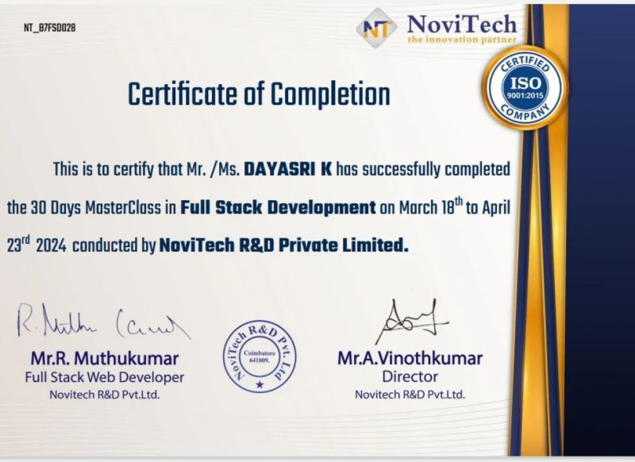

# 🌐 Dayasri's Personal Portfolio

Welcome to my personal portfolio website! I'm **Dayasri**, a Computer Science Engineering student passionate about web development, programming, and problem-solving. This portfolio showcases my projects, certifications, skills, and contact information — all in one place.

## 🔗 Live Website

👉 [Visit Portfolio](https://sridaya.github.io/Dayasri-Portfolio-V3/)

## 📄 Resume

📥 [View My Resume](https://drive.google.com/file/d/1FDkH671eh_fl8pkYu008Yg4ZcsHHvpuS/view)

## 💻 What’s Included

- ✅ About Me Section
- ✅ Skills Overview
- ✅ Live Project Previews
- ✅ Certifications Display
- ✅ Contact Information with Email Icon
- ✅ Responsive Design for Desktop & Mobile

## 🛠️ Technologies Used

- HTML5  
- CSS3  
- JavaScript  
- Git & GitHub  
- Responsive Web Design

## 📸 Screenshots

| Landing Page | Certifications | Contact Section |
|--------------|----------------|------------------|
|  |  |  |

## 🚀 How to Run Locally

1. Clone the repo:
   ```bash
   git clone https://github.com/Sridaya/Dayasri-Portfolio-V3.git
